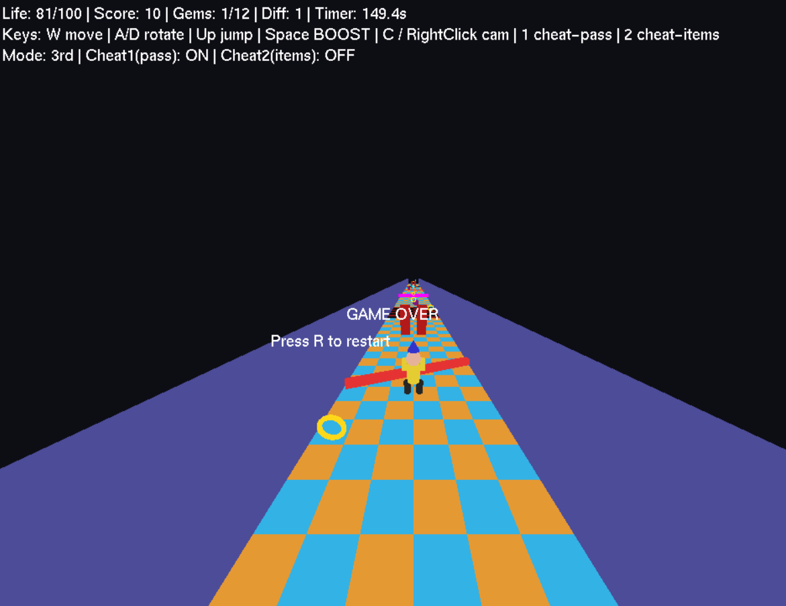

# RagePath 3D – Frustration-Based Obstacle Game

## 🎮 Overview
RagePath 3D is a 3D frustration-based obstacle game developed as part of **CSE423 (Computer Graphics)**.
The game challenges players to navigate a deceptive obstacle course that tests patience,
precision, and spatial awareness through repeated failure–retry cycles.

Inspired by classic frustration-style games, all rendering, camera control, and gameplay logic
were implemented from scratch using the CSE423 Assignment-3 template.

## 🎯 Objective
- Navigate a fully 3D obstacle arena
- Avoid falling, hazards, and moving obstacles
- Reach the final platform to complete the level
- Respawn on failure using checkpoints
- Track death count and completion time

## 🛠 Technologies Used
- Python
- OpenGL / PyOpenGL
- GLUT

## ✨ Core Features
- First-person and third-person camera modes (toggleable)
- Player movement: rotation, forward/backward motion, and jumping
- Rotating obstacles and moving platforms
- Fake platforms, trap walls, and falling hazards
- Moving enemy objects that damage the player
- Collectible gems that affect score or life
- Multiple game states: Start, Pause, Game Over, Win
- Game reset functionality
- Dynamic difficulty scaling

## 🧪 Cheat Modes
- Cheat Mode 1: Ignore hazards (except falling platforms)
- Cheat Mode 2: Auto-collect collectibles

## 👥 Team Project
This project was developed collaboratively as part of a group submission for CSE423.

## ▶️ How to Run
1. Install required dependencies (PyOpenGL, GLUT)
2. Run the main Python file:
   ```bash
   python main.py
## 🖼 Screenshots

### Gameplay & Obstacles



### Game Reset State

